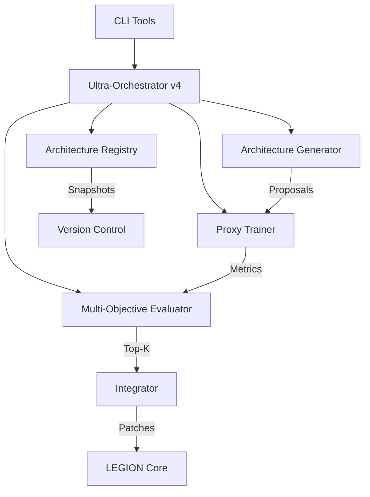

# Ultra-Orchestrator v4: Neuro-Rewriter

## Обзор

Ultra-Orchestrator v4 "Neuro-Rewriter" — это автоматическая система эволюции нейроархитектуры LEGION.

### Ключевые возможности

- ✅ **NAS-lite**: Генерация и тестирование вариантов архитектур
- ✅ **LoRA/Adapters**: Применение адаптеров для минимального обучения
- ✅ **Proxy Training**: Быстрое экспериментирование
- ✅ **Multi-Objective Optimization**: Многокритериальная оценка
- ✅ **Immutable Registry**: Версионирование архитектур
- ✅ **CI/CD Integration**: Автоматический pipeline

## Архитектура



## Быстрый старт

### 1. Генерация архитектур

```bash
python tools/ultra_orchestrator.py generate \
  --task summarization \
  --n 12 \
  --strategies LoRA,MoE,Adapter
```

### 2. Proxy Training

```bash
for proposal in orchestrator/proposals/*.json; do
  id=$(basename $proposal .json)
  python tools/ultra_orchestrator.py train \
    --proposal $id \
    --data data/task_small/ \
    --steps 2000
done
```

### 3. Оценка

```bash
python tools/ultra_orchestrator.py evaluate \
  --runs artifacts/proxy_runs/* \
  --weights "accuracy:0.5,latency:0.2,safety:0.3"
```

### 4. Интеграция

```bash
python tools/ultra_orchestrator.py integrate --top 3
```

## Стратегии архитектур

### LoRA (Low-Rank Adaptation)

```python
from legion.neuro_architecture import LoRAAdapter

adapter = LoRAAdapter(rank=8, alpha=32)
adapter.apply(model)
```

### MoE (Mixture-of-Experts)

```json
{
  "strategy": "MoE",
  "num_experts": 8,
  "top_k": 2,
  "load_balancing": true
}
```

### Bottleneck Adapters

```python
from legion.neuro_architecture import BottleneckAdapter

adapter = BottleneckAdapter(bottleneck_size=64)
```

## Metrics и Scoring

### Multi-Objective Formula

```
score = α*accuracy - β*latency - γ*cost - δ*safety_violations + ε*robustness
```

**Weights по умолчанию:**
- `accuracy`: 0.5
- `latency`: 0.2
- `cost`: 0.15
- `safety`: 0.1
- `robustness`: 0.05

## CI/CD Integration

### GitHub Actions Workflow

Файл: `.github/workflows/neuro_rewriter_ci.yml`

```yaml
name: Ultra-Orchestrator v4 CI

on:
  pull_request:
    branches: [main]

jobs:
  neuro-evolution:
    runs-on: ubuntu-latest
    steps:
      - uses: actions/checkout@v4
      - name: Baseline Snapshot
        run: python tools/baseline_snapshot.py --out artifacts/baseline.json
      - name: Generate Proposals
        run: python tools/ultra_orchestrator.py generate --task ${{ github.event.pull_request.title }} --n 5
      - name: Proxy Training
        run: |
          for p in orchestrator/proposals/*.json; do
            python tools/ultra_orchestrator.py train --proposal $(basename $p .json) --data data/ci_test/ --steps 500
          done
      - name: Evaluate
        run: python tools/ultra_orchestrator.py evaluate --runs artifacts/proxy_runs/*
```

## Architecture Registry

### Регистрация архитектуры

```python
from legion.neuro_architecture import ArchitectureRegistry

registry = ArchitectureRegistry()

snapshot = registry.register(
    version="4.1.0",
    config={"strategy": "LoRA", "rank": 8},
    metrics={"accuracy": 0.92, "latency_ms": 45},
    provenance={"branch": "main", "commit": "abc123"},
    tags=["production", "lora"]
)

print(f"Registered: {snapshot.semantic_hash}")
```

### Получение архитектуры

```python
# По hash
snapshot = registry.get("a1b2c3d4e5f6g7h8")

# По тегу
production_archs = registry.get_by_tag("production")

# Все архитектуры
all_archs = registry.list_all()
```

## Безопасность

### Safety Gates

1. **Risk Assessment**: Каждый proposal получает risk score (0.0-1.0)
2. **Manual Approval**: High-risk изменения требуют подтверждения
3. **Shadow Testing**: Тестирование без влияния на production
4. **Canary Deployment**: Постепенный rollout
5. **Auto-Rollback**: При деградации метрик

## Примеры использования

### Programmatic API

```python
from legion.neuro_architecture import (
    ArchitectureGenerator,
    ProxyTrainer,
    MultiObjectiveEvaluator
)

# 1. Генерировать proposals
generator = ArchitectureGenerator(seed=42)
proposals = generator.generate(
    task="classification",
    n=10,
    strategies=["LoRA", "MoE"]
)

# 2. Обучить
for proposal in proposals:
    trainer = ProxyTrainer(proposal.id)
    metrics = trainer.train(
        data_path="data/classification/",
        steps=2000
    )

# 3. Оценить
evaluator = MultiObjectiveEvaluator()
results = evaluator.evaluate(
    metrics_files=["artifacts/proxy_runs/*/metrics.json"]
)

# 4. Лучшие 3
top_3 = results[:3]
for r in top_3:
    print(f"{r.proposal_id}: {r.composite_score:.3f}")
```

## Roadmap

### Текущий статус (v4.0.0)

- ✅ Базовая структура
- ✅ Architecture Generator
- ✅ Proxy Trainer (эмуляция)
- ✅ Multi-Objective Evaluator
- ✅ Architecture Registry
- ✅ CLI Tools

### v4.1.0 (Q1 2026)

- 🔧 Реальная интеграция с PEFT/LoRA
- 🔧 vLLM/Ollama поддержка
- 🔧 Автоматическое применение patches
- 🔧 Canary deployment automation

### v4.2.0 (Q2 2026)

- 📅 Model surgery (объединение, разделение)
- 📅 Progressive distillation
- 📅 Kubernetes integration
- 📅 Distributed training

## Ссылки

- [LEGION Core](../README.md)
- [Architecture Patterns](../src/legion/orchestration/patterns.py)
- [CI Healer Agent](../src/legion/agents/ci_healer_agent.py)
- [GitHub Repository](https://github.com/legion14041981-ui/Legion)
