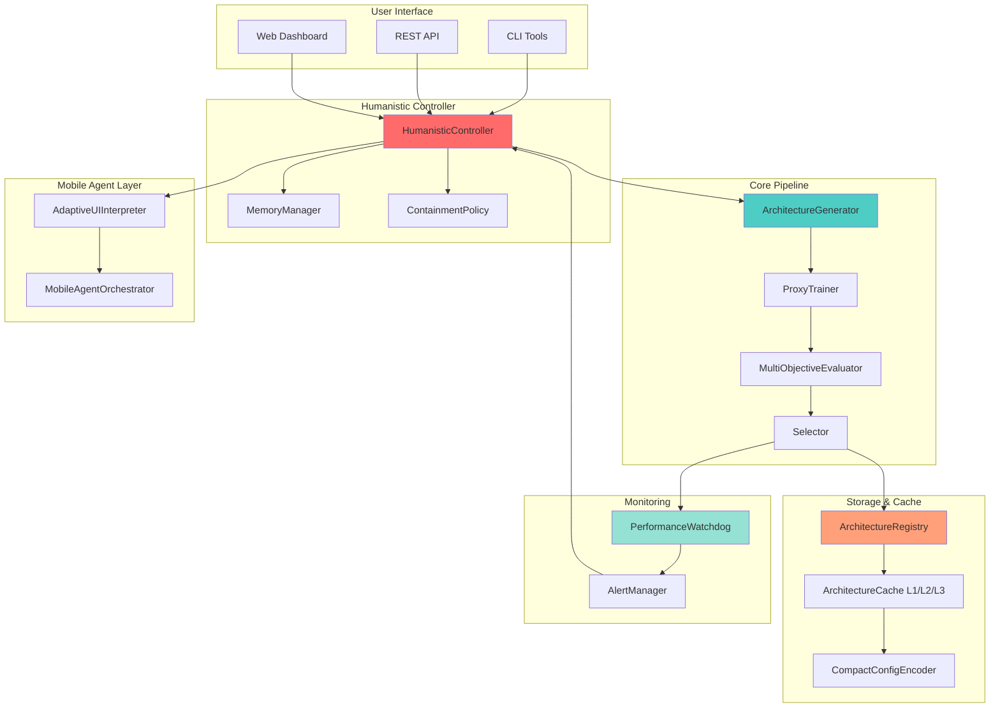
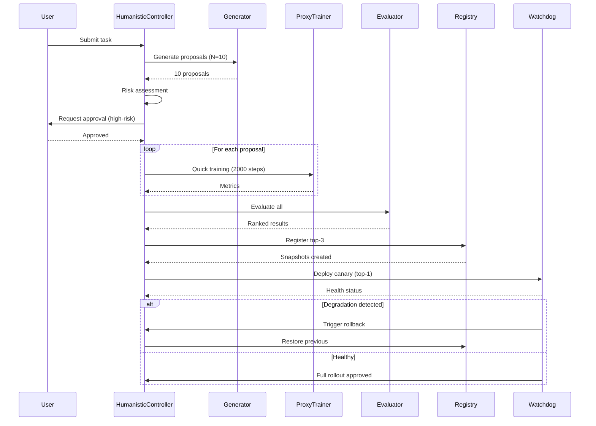
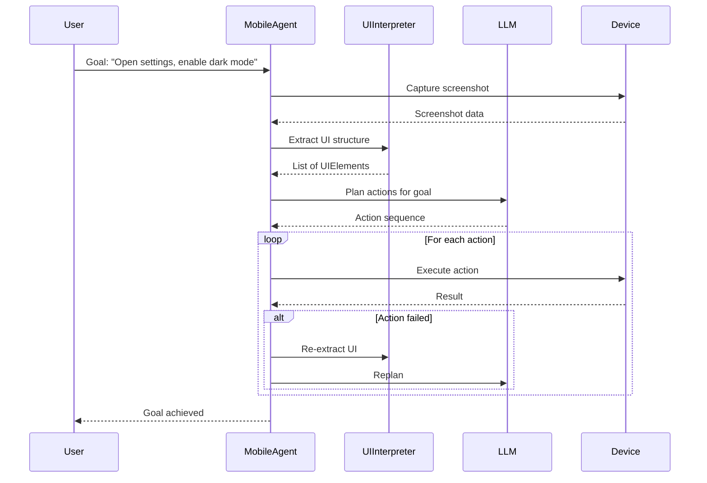
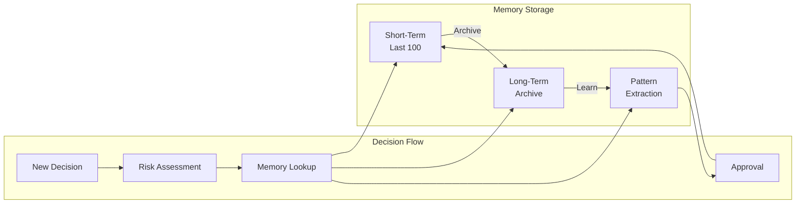

# Ultra-Orchestrator v4: Complete Architecture Specification

## System Overview



## Component Interactions

### 1. Architecture Evolution Cycle



### 2. Mobile Agent Workflow (DroidRun-style)



### 3. Memory & Learning System



## Key Features

### 1. Humanistic AI Principles

**Safety Gates:**
- Risk scoring (0.0-1.0)
- Automatic approval < 0.3 (conservative mode)
- User approval required > 0.6
- Critical changes always require approval

**Memory Integration:**
- Remembers all past decisions
- Learns from successful/failed experiments
- Recommends based on history
- Transparent reasoning

**Containment:**
- Prevents autonomous harmful actions
- Manual approval for critical changes
- Automated rollback on degradation
- Canary deployment for safety

### 2. Mobile Agent Capabilities

**Adaptive UI Understanding:**
- Screenshot → structured UIElements
- LLM-based action planning
- Self-healing on UI changes
- Natural language goals

**Multi-Agent Orchestration:**
- Coordinate multiple agents
- Parallel task execution
- Handoff between agents
- Failure recovery

### 3. Storage Optimization

**Compact Encoding:**
- MessagePack: 70% smaller than JSON
- Binary format for efficiency
- Compression for long-term storage

**Multi-Level Cache:**
```
L1 (Memory)  → 10 items    → <1ms access
L2 (Redis)   → 1000 items  → <10ms access
L3 (Disk)    → ∞ items     → <100ms access
```

**Cache Hit Rate Target:** 85%+

### 4. Performance Monitoring

**Watchdog Thresholds:**
- Error rate > 5% → rollback
- Latency +20% → warning
- Memory +50% → warning
- 3 consecutive failures → rollback

**Automated Rollback:**
- Detect degradation
- Restore previous snapshot
- Notify stakeholders
- Post-mortem analysis

## Success Metrics

| Metric | Baseline | v4.0 Target | v4.1 Target |
|--------|----------|-------------|-------------|
| **Proposals/hour** | 0 | 10 | 50 |
| **Evaluation time** | - | <5 min | <1 min |
| **Cache hit rate** | - | 80% | 90% |
| **Storage efficiency** | 0% | 70% | 80% |
| **Self-healing success** | - | 75% | 90% |
| **User approval rate** | - | <30% | <15% |
| **Rollback rate** | - | <5% | <2% |
| **Health check rate** | - | 98% | 99.5% |

## API Examples

### 1. Generate and Evaluate

```python
from legion.neuro_architecture import (
    HumanisticController,
    ArchitectureGenerator,
    ProxyTrainer,
    MultiObjectiveEvaluator
)

# Initialize controller
controller = HumanisticController(mode="standard")

# Generate proposals
generator = ArchitectureGenerator(seed=42)
proposals = generator.generate(
    task="summarization",
    n=10,
    strategies=["LoRA", "MoE", "Adapter"]
)

# Evaluate each proposal
for proposal in proposals:
    evaluation = controller.evaluate_proposal(proposal)
    
    if evaluation['approval_required']:
        approved = controller.request_approval(proposal, evaluation)
        if not approved:
            continue
    
    # Train
    trainer = ProxyTrainer(proposal.id)
    metrics = trainer.train(data_path="data/", steps=2000)

# Multi-objective evaluation
evaluator = MultiObjectiveEvaluator()
results = evaluator.evaluate(
    metrics_files=["artifacts/proxy_runs/*/metrics.json"]
)

# Deploy top-3
top_3 = results[:3]
for result in top_3:
    print(f"{result.rank}. {result.proposal_id}: {result.composite_score:.3f}")
```

### 2. Mobile Agent Automation

```python
from legion.neuro_architecture import AdaptiveUIInterpreter

# Initialize agent
agent = AdaptiveUIInterpreter(llm_provider="ollama", model="llama3")

# Extract UI
elements = agent.extract_structure("screenshot.png")

# Plan actions
goal = "Open settings and enable dark mode"
actions = agent.plan_actions(goal, elements)

# Execute with self-healing
result = agent.execute_with_healing(actions, max_retries=3)

if result['success']:
    print("✅ Goal achieved")
else:
    print(f"❌ Failed: {result['error']}")
```

### 3. Performance Monitoring

```python
from legion.neuro_architecture.watchdog import PerformanceWatchdog

# Initialize watchdog
watchdog = PerformanceWatchdog(check_interval=60)

# Set baseline
baseline = {
    'error_rate': 0.01,
    'latency_ms': 50.0,
    'memory_mb': 2000,
    'cpu_percent': 30.0
}
watchdog.set_baseline(baseline)

# Check health
current = {
    'error_rate': 0.06,  # Exceeds 5% threshold!
    'latency_ms': 65.0,  # +30% from baseline
    'memory_mb': 2200,
    'cpu_percent': 40.0
}

result = watchdog.check_health(current)

if watchdog.should_rollback(result):
    print("🛑 Rollback triggered")
    watchdog.trigger_rollback(
        current_snapshot_id="snapshot-abc123",
        previous_snapshot_id="snapshot-xyz789"
    )
```

## Deployment Strategies

### Shadow Testing
```yaml
stage: shadow
traffic: 0%
duration: 24h
metrics:
  - accuracy
  - latency
  - error_rate
```

### Canary Deployment
```yaml
stages:
  - name: canary_5pct
    traffic: 5%
    duration: 48h
    rollback_on:
      error_rate: ">0.05"
      latency_degradation: ">20%"
  
  - name: canary_25pct
    traffic: 25%
    duration: 72h
  
  - name: full_rollout
    traffic: 100%
```

## Security & Compliance

**Immutable Snapshots:**
- Cryptographic hashing (SHA-256)
- Checksum validation
- Version derivation (BIP32-style)
- Tamper detection

**Audit Trail:**
- All decisions logged
- User approvals recorded
- Rollback history tracked
- Provenance metadata

**Access Control:**
- Role-based permissions
- Critical actions require approval
- Containment policies enforced

## Next Steps

1. ✅ Core modules implemented
2. 🔄 CLI tools integration
3. 🔄 CI/CD pipeline
4. 🔄 Web dashboard
5. 📅 Real LLM integration (vLLM, Ollama)
6. 📅 Mobile device integration (ADB)
7. 📅 Distributed training support
